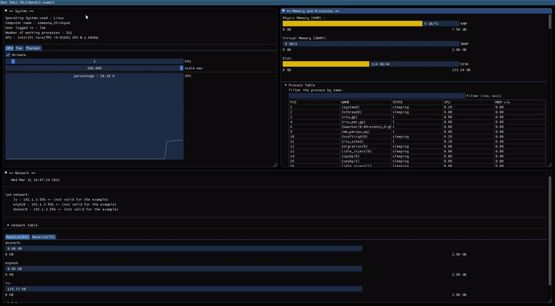
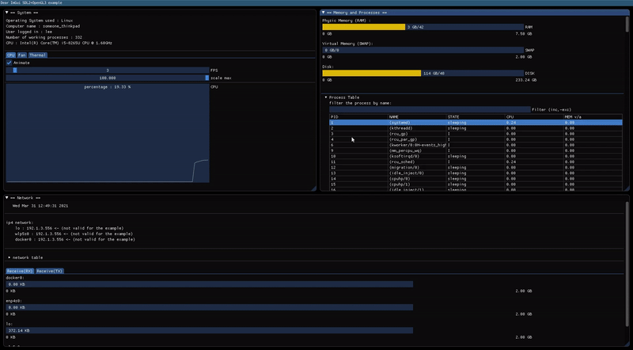
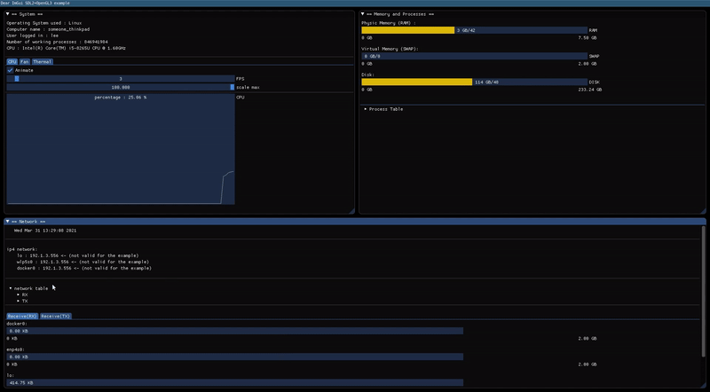

#   🖥️ SYSTEM MONITOR
##  DESCRIPTION
System monitor is an application you are about to work on is a [**Desktop System Monitor**](https://en.wikipedia.org/wiki/System_monitor). The app will monitor the computer system resources and performance, such as CPU, RAM, SWAP, Fan, Network and more.
For the GUI you will use the [_Dear ImGui_](https://github.com/ocornut/imgui/wiki#about-the-imgui-paradigm) library for C++.

##  FILE TREE
```console
$ tree system-monitor
├── header.h
├── imgui                                 // <-- ImGui APIs
│   └── lib
│       ├── backend                       // <-- ImGui backend
│       │   ├── imgui_impl_opengl3.cpp
│       │   ├── imgui_impl_opengl3.h
│       │   ├── imgui_impl_sdl.cpp
│       │   └── imgui_impl_sdl.h
│       ├── gl3w
│       │   └── GL
│       │       ├── gl3w.c
│       │       ├── gl3w.h
│       │       └── glcorearb.h
│       ├── imconfig.h
│       ├── imgui.cpp
│       ├── imgui_demo.cpp
│       ├── imgui_draw.cpp
│       ├── imgui.h
│       ├── imgui_internal.h
│       ├── imgui_tables.cpp
│       ├── imgui_widgets.cpp
│       ├── imstb_rectpack.h
│       ├── imstb_textedit.h
│       └── imstb_truetype.h
├── main.cpp                             // <-- main file, where the application will
├── Makefile                             //     render (main loop)
├── mem.cpp                              // <-- memory resources and processes information
├── network.cpp                          // <-- network resources
└── system.cpp                           // <-- all system resources

5 directories, 28 files
```

##  STEPS

+   [ ] **System monitor**, that will contain :
    +   [ ] The type of OS (Operating System).
    +   [ ] The user logged into the computer.
    +   [ ] The computer name, this being the **hostname**.
    +   [ ] The total number of tasks/processes that are currently running, sleeping, uninterruptible, zombie, traced/stopped or interrupted.
    +   [ ] Type of CPU
    +   [ ] A tabbed section containing `CPU`, `Power`, `Fan` and `Thermal` information, this information include a performance graphic for all those topics.
    This graph should contain some kind of checkbox or button to be able to stop the animation whenever the user desires to do so.
    Additionally, it should also have two slider bars.
    The first slider bar should be able to control the `FPS` of the graph, and the second slider bar should control the `y` scale of the graph.
    +   [ ] `CPU` should present this graph with an overlay text saying the current percentage of the CPU.
    +   [ ] `Fan`, should include the following information, the status of the fan, (enable/active), the current speed and the level. And should also present the graph stated above.
    +   [ ] `Thermal`, should present the graph stated above with an overlay text saying the current temperature of the computer (usually the cpu sensor). 
    example :

    

+   [ ] **Memory and process monitor**, that will contain :
    +   [ ] The Physic Memory (RAM) being used, it must have some kind of visual display of this usage.
    +   [ ] The Virtual Memory (SWAP) being used, it should also include a visual display.
    +   [ ] The Disk usage, same here.
    +   [ ] A tab bar that should contain a table of processes with the following columns :
    +   [ ] **PID**, with the process identification.
    +   [ ] **Name**, name of the process.
    +   [ ] **State**, current state of the process.
    +   [ ] **CPU usage**, how much CPU the process is using in percentage.
    +   [ ] **Memory usage**, how much memory the process is using in percentage.
    +   [ ] A text box that lets the user filter the table. Users must be able to select multiple rows of the table.
    example :

    

+   [ ] **Network**, that will contain :
    +   [ ] The network ipv4, (`lo`, `wlp5s0` and other networks that the computer may have).
    +   [ ] A tab bar that should contain two tables :
    +   [ ] `RX` (network receiver) containing the following data : bytes, packets, errs, drop, fifo, frame, compressed and multicast.
    +   [ ] `TX` (network transmitter) containing the following data : bytes, packets, errs, drop, fifo, colls, carrier and compressed.
    +   [ ] It should also contain a tabbed section for both `RX` and `TX`, those sections should display a visual usage (ex: a progress bar), of all network present on the computer. This visual display should obey the following rules:
    +   [ ] Each network should be converted from **bytes** to **GB**, **KB** or **MB** depending on the value. It should not display values that
      are too big or too small. In other words it should be adjustable.
      example :

      **452755738 bytes** => **431.78 MB**. // perfect\
      **452755738 bytes** => **0.42 GB**. // too small\
      **452755738 bytes** => **442144.28.6 KB**. // too big

    +   [ ] The visual display should go from 0GB to 2GB
    example :

    
